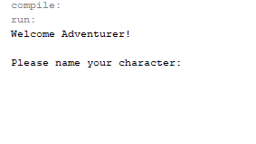

Portfolio
=========

Programming Projects
--------------------

*For access to my private project repositories, please [email me](mailto:jcway@csustudent.net?subject=GitHub%20Access) with the subject line, GitHub Access.

---
### [Project 1 Title | CSCI 301](project1)

---
### [Project 2 Title | CSCI 315](project1)

---
### [Castle of Conquest | CSCI 325](project1)

---
### [Project 4 Title | CSCI 332](project1)

---

Ethics Papers
-------------

### [Programming in Healthcare](/pdf/Programming in Healthcare.pdf)

-   **Class: CSCI 315**  
-   **Grade: 95**

### [Ethics in the Workplace](/pdf/Ethics in the Workplace.pdf)

-   **Class: CSCI 325** 
-   **Grade: 80**

### [Copyright Ethics](/pdf/Copyright Ethics.pdf)

-   **Class: CSCI 301** 
-   **Grade:**

---

Presentations
-------------

### [Target Credit Card Breach](/pdf/Target Credit Card Breach.pdf)

- **Class: CSCI 301** 
- **Grade:**

### [Presentation 2 Title](/pdf/sample_presentation.pdf)

- **Class:** 
- **Grade:**

---

Page template forked from <a href="https://github.com/csu-cs/csci-portfolio">CSU-CS</a>

<!-- Remove above link if you don't want to attributive -->
