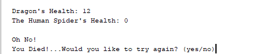

[Back to Portfolio](./)

Castle of Conquest
===============

-   **Class: 325** 
-   **Grade: 100** 
-   **Language(s): Java** 
-   **Source Code Repository:** [Castle-of-Conquest](https://github.com/JamesCalebWay/Castle-of-Conquest)  
    (Please [email me](mailto:jcway@csustudent.net?subject=GitHub%20Access) to request access.)

## Project description

Castle of Conquest is a text-based adventure game where a player traverses through a series of areas, fighting monsters along the way. The player must make their way through four levels before they face off against the final boss to protect their land and win the game. Your hero, guided by a fairy named Nova, must find their way through the land of Ukro to stop the corrupted king in his evil ways.

At the start of the game the user will be able to name their character (Fig 1.).

  
Fig 1. Sarting the Game

Once a name is chosen, you will be asked to accept the quest. If you chose "no", then the game will end (Fig 2).

  
Fig 2. Do not accept quest

If the play accepts the quest then they will start battle (Fig 3).

  
Fig 3. Accept quest and start battle

Once an enemy is defeated the player will be asked if they would like to continue (Fig 4).

  
Fig 4. Defeat Enemy

The player starts the game out with 5 health potions and will be promted to use one after each attack. Defeating enemies will grant the player one heath potion. After running out of potions the player will be asked if they would like to continue the game (Fig 5.)

  
Fig 5. No more potions prompt

If the user dies they will be given the option to restart the current level. If they chose not to restart then the game ends (Fig 6).

  
Fig 5. No more potions prompt

## How to compile and run the program

The game runs in the terminal of the Apache Netbeans IDE which can to be downloaded [here](https://netbeans.apache.org/download/index.html).

Once Apache Netbeans is set up and running, click the green run button at the top of the IDE to run the game.

## UI Design

The UI is text based.

## 3. Additional Considerations

Sed ut perspiciatis unde omnis iste natus error sit voluptatem accusantium doloremque laudantium, totam rem aperiam, eaque ipsa quae ab illo inventore veritatis et quasi architecto beatae vitae dicta sunt explicabo. 

For more details see [GitHub Flavored Markdown](https://guides.github.com/features/mastering-markdown/).

[Back to Portfolio](./)
